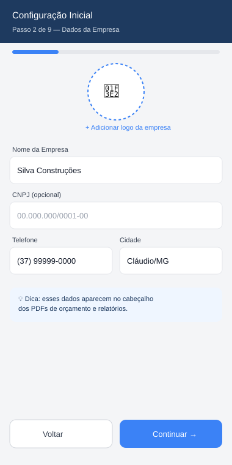
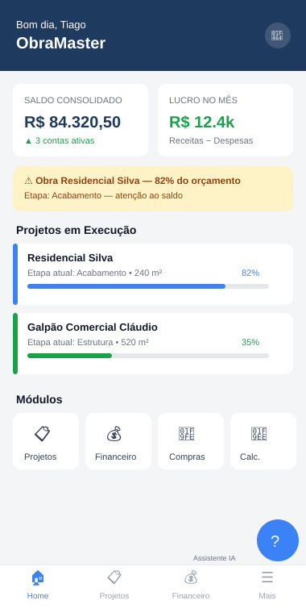
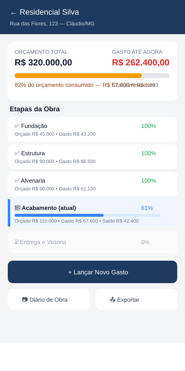
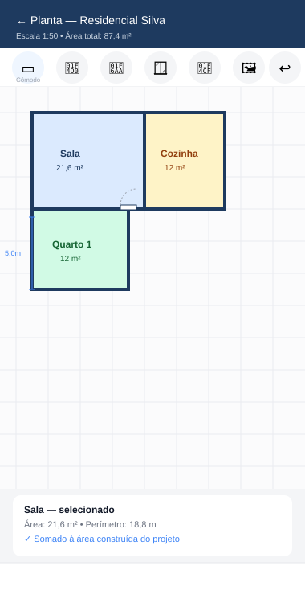
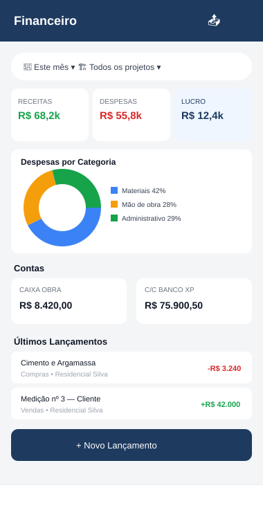
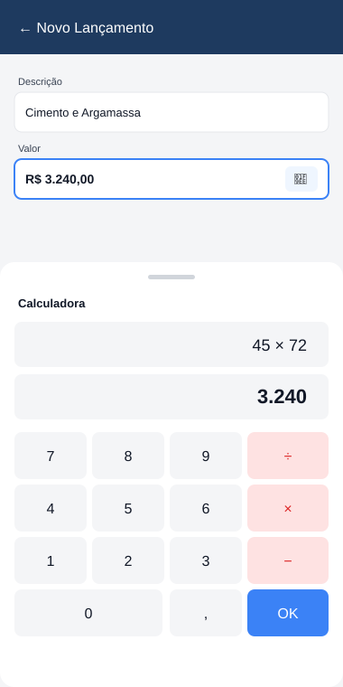
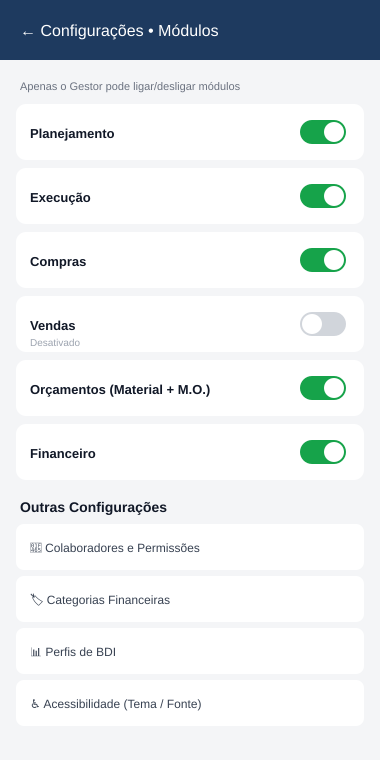

# Manual do ObraMaster

> Guia de uso para quem vai operar o sistema no dia a dia.
> Colocar em: `docs/MANUAL_DO_PROGRAMA.md`
> As imagens abaixo são **wireframes ilustrativos** (o app real terá o mesmo layout, com o visual final do tema aplicado). Ficam em `docs/mockups/`.
> Este manual é a **fonte de conteúdo do Assistente de IA** (ver `SPEC_ASSISTENTE_IA.md`) — cada seção tem um identificador (`#id`) usado pela IA para apontar "onde está no manual".

---

## Sumário

1. Primeiro Acesso e Login
2. Tela Inicial (Home)
3. Módulos — Ligar e Desligar
4. Projetos e Etapas
5. Financeiro (Dashboard, Contas, Lançamentos, Categorias, Centro de Custo)
6. Compras
7. Orçamentos (com BDI)
8. Vendas
9. Equipes e Pagamentos
10. Planejamento e Execução
11. Metas
12. Pessoas
13. Cadastros Básicos
14. Calculadoras
15. Exportação (PDF, XLSX, JPG)
16. Configurações e Permissões
17. Acessibilidade
18. Assistente de IA

---

## 1. Primeiro Acesso e Login `#login`

No primeiro uso, um assistente de configuração inicial (onboarding) pede os dados da sua empresa, cria seu acesso de Gestor e já deixa módulos e ao menos uma conta financeira prontos para uso — em 12 etapas curtas, só quatro delas obrigatórias (Empresa, Gestor, Módulos, Contas Financeiras). Tudo o mais (categorias, perfil de BDI, template de etapas, colaboradores extras, primeiro projeto, acessibilidade) pode ser pulado e preenchido depois em Configurações — o app nunca trava por falta de um dado secundário.

Fechar o app no meio do onboarding e reabrir retoma exatamente na etapa em que parou (a senha digitada é a única coisa que precisa ser redigitada, por segurança — ela não fica salva em rascunho). **Nada é gravado no banco até você confirmar na tela final de Resumo.**

*(O modo "Configurar com ajuda da IA" aparece na tela de boas-vindas, mas ainda mostra aviso de indisponível — depende do backend, que chega na Fase 10. Por enquanto, o formulário tradicional é o único caminho.)*

Nos acessos seguintes (depois que já existe um Gestor), a tela de login pede usuário e senha. Se o Gestor cadastrar outros colaboradores (seção 16), cada um entra com seu próprio login e só vê os módulos que tiver permissão.

**Exemplo prático:** você contrata um administrativo para lançar notas de compra. O Gestor cadastra esse colaborador com acesso de **escrita** só no módulo Compras e **leitura** no Financeiro — ele lança as notas, mas não vê o lucro da empresa.

---

## 2. Tela Inicial (Home) `#home`

Assim que você loga, a Home mostra a **grade de módulos** ativos e permitidos para o seu usuário, adaptada ao tamanho da tela (barra inferior no celular, menu lateral recolhido em tablet, menu lateral fixo em desktop/web) — e um atalho para Configurações e para sair.

As peças abaixo chegam nas próximas fases, quando os módulos que elas dependem existirem:
- **Saldo consolidado** e **lucro do mês** — dependem do módulo Financeiro (seção 5)
- **Alertas de orçamento** e **projetos em execução** — dependem do módulo Projetos (seção 4)
- O botão do **Assistente de IA** — chega na Fase 11 (seção 18)

**Exemplo prático (visão final, quando os módulos acima existirem):** ao abrir o app de manhã, você vai ver de cara que a obra "Residencial Silva" está em 82% do orçamento na etapa de Acabamento — isso já avisa que é hora de revisar os próximos gastos dessa etapa antes de continuar comprando.

---

## 3. Módulos — Ligar e Desligar `#modulos`

O sistema é modular: cada setor (Compras, Vendas, Planejamento, etc.) pode ser **ativado ou desativado** pelo Gestor em Configurações → Módulos (seção 16.2). Módulo desativado some do menu de todos os colaboradores.

**Exemplo prático:** se sua empresa ainda não trabalha com vendas formais (só executa obra para terceiros), pode desligar o módulo Vendas até precisar dele — deixa o app mais limpo para o dia a dia.

---

## 4. Projetos e Etapas `#projetos`

Cada obra é cadastrada como um **Projeto**, com endereço, área construída, área do terreno e um **orçamento total**. Dentro do projeto, você cadastra as **etapas**, cada uma com seu próprio orçamento, progresso (%) e status — ou toca em "Aplicar template padrão" pra já criar Fundação → Estrutura → Alvenaria → Instalações → Acabamento → Entrega de uma vez (o mesmo template que você já pode ter escolhido no onboarding). Reordenar etapa é pelas setinhas ↑↓ no card dela.

- A tela do projeto mostra orçamento, gasto até agora, saldo e uma barra que muda de cor: verde (tranquilo), amarelo (acima de 80% do orçamento), vermelho (estourou)
- O sistema calcula sozinho o **custo por m²**, tanto pela área construída quanto pela área do terreno (aparece quando a área correspondente foi preenchida)
- Se você tinha começado a cadastrar um projeto no onboarding e pulou aquela etapa, um aviso aparece no topo da lista de Projetos oferecendo concluir o cadastro ou descartar

*(O "gasto até agora" ainda aparece zerado — ele é alimentado automaticamente por Compras, Equipes/Pagamentos e Financeiro, que chegam nas próximas fases. O cálculo já funciona de verdade; falta só a origem dos lançamentos. O botão "Diário de Obra" com fotos chega junto do módulo Execução.)*

**Exemplo prático (visão final, quando os módulos de gasto existirem):** a etapa Acabamento está orçada em R$ 110.000, já gastou R$ 67.600 — o app mostra o saldo de R$ 42.400 automaticamente, sem você precisar somar nada na mão.

### 4.1 Planta Baixa `#planta-baixa`

Dentro do projeto, a seção "Plantas Baixas" deixa desenhar um esboço da obra em vez de digitar a área na mão:

- **▭ Retângulo**: arrasta na tela e já vira um cômodo com 4 paredes.
- **📐 Polígono livre**: toque ponto a ponto (cômodos em L, formatos irregulares) — fecha sozinho quando você toca perto do ponto onde começou.
- **🚪/🪟 Porta e janela**: toque numa parede já desenhada para inserir.
- **📏 Medir**: dois toques mostram a distância real entre eles, sem criar nada.
- Cada cômodo mostra nome e área calculada direto no desenho; tocar nele abre um painel pra renomear ou excluir.
- A grade (grid) ajuda a manter proporção; o ícone de régua na barra superior deixa ajustar quantos metros vale cada quadrado da grade.
- Botão desfazer volta a última forma criada.

Depois de desenhado, o botão **"Calcular área a partir da planta"** (na tela do projeto) soma a área de todos os cômodos de todas as plantas e preenche a área construída do projeto — sem sobrescrever nada sozinho, só quando você confirma.

**Exemplo prático:** você desenha a Sala (retângulo) e o Quarto 1 (polígono em L, por causa do closet) — o app mostra 18m² e 12m², respectivamente. Ao tocar em "Calcular área a partir da planta", os 30m² substituem o valor que estava (ou não) preenchido manualmente na área construída do projeto.

#### Importar foto e calibrar escala `#planta-baixa-importar-foto`

O ícone de imagem na barra superior do editor abre o painel "Imagem de fundo":

- **Importar foto**: tira uma foto na hora ou escolhe da galeria (no Android e na Web; no iOS essa função ainda não está disponível — ver nota abaixo). A foto vira uma camada de fundo no editor, para você desenhar as paredes por cima dela.
- **Mostrar/ocultar** a foto de fundo com um toque, sem perder o desenho.
- **Opacidade**: um controle deslizante deixa a foto mais clara ou mais escura, pra facilitar enxergar as linhas desenhadas por cima.
- **📐 Calibrar** (novo botão na barra de ferramentas, some quando não há foto importada): toque em dois pontos da foto que você sabe a distância real entre eles (ex.: as duas pontas de uma porta) e informe essa distância em metros — o app recalcula sozinho quanto vale cada quadrado da grade a partir daí, substituindo a escala manual.
- **Trocar foto** troca a imagem de fundo a qualquer momento; a escala calibrada anteriormente não é alterada automaticamente — recalibre se a nova foto tiver uma proporção diferente.

*(Esse fluxo não faz leitura automática de medidas na foto (OCR) — a calibração por dois toques é sempre manual, mas rápida. No iOS, importar foto ainda não está disponível nesta fase; a tela mostra a mensagem de indisponível e o restante do editor funciona normalmente. Exportar a planta em PDF/JPG chega junto da Fase 9.)*

**Exemplo prático:** você fotografa uma planta impressa do projeto, importa a foto, toca nas duas pontas de uma porta que mede 0,80m na realidade e digita "0,8" quando o app pergunta a distância — a partir daí, cada quadrado da grade passa a refletir a escala real da foto, e os cômodos que você desenhar por cima já saem com a área certa.

#### Importar arquivo DXF `#planta-baixa-importar-dxf`

O ícone de upload na barra superior do editor ("Importar arquivo") abre o seletor de arquivo e lê um **DXF** direto — paredes e cômodos do desenho técnico entram prontos, sem precisar redesenhar:

- Se o arquivo DXF traz a unidade de medida gravada nele (metros, centímetros, milímetros ou polegadas), a escala é **calibrada automaticamente** — você não precisa fazer nada, os cômodos já aparecem com a área certa.
- Se o arquivo não tem essa informação, a planta é importada mesmo assim (geometria correta, só a escala que falta) e o editor já entra na ferramenta de calibração — dois toques numa medida conhecida do próprio desenho importado e pronto, igual à calibração por foto.
- Nomes de cômodo escritos no próprio DXF (texto perto do desenho da sala, ex.: "Sala", "Quarto 1") viram o nome do cômodo automaticamente, quando o programa consegue casar um com o outro.
- Antes de confirmar, uma tela de prévia mostra quantas paredes e cômodos foram encontrados, se a escala foi detectada ou não, e a lista de **camadas** (layers) do DXF — toque numa camada pra excluí-la da importação (útil pra pular camadas de cota/anotação que não fazem parte do desenho em si).
- Nada é importado sem você confirmar em "Importar para a Planta"; o botão "Cancelar" descarta a leitura sem mexer na planta atual.
- Um aviso abaixo do título do editor mostra "Importado de [nome do arquivo]" depois que uma importação é confirmada, pra você lembrar a origem da planta depois.

*(Importação de PDF ainda não está disponível — chega numa próxima fase. Elementos redondos (círculos) do DXF são ignorados por enquanto, fora do escopo desta primeira versão do importador.)*

**Exemplo prático:** o arquiteto manda o DXF da planta com `$INSUNITS` gravado em metros — você importa, a tela de prévia mostra "18 paredes e 5 cômodos detectados, escala detectada automaticamente (unidade: metros)", você confere as camadas, toca em "Importar para a Planta" e os cômodos já aparecem no editor com nome e área corretos, prontos pra ajustar se precisar.

#### Importar arquivo SVG `#planta-baixa-importar-svg`

O mesmo botão "Importar arquivo" também lê **SVG** — útil quando a planta veio de uma ferramenta de desenho vetorial em vez de um software de CAD:

- Formas básicas do SVG (retângulo, linha, polígono, polilinha e a maioria dos traçados `<path>` simples — linhas retas e curvas, essas últimas aproximadas por segmentos de reta) viram paredes e cômodos, do mesmo jeito que no DXF.
- A escala só é detectada automaticamente no caso raro do SVG trazer `viewBox` junto com largura/altura numa unidade real (milímetros, centímetros ou polegadas) — a grande maioria dos SVGs exportados de ferramentas de design usa pixels sem significado físico, então **o normal é cair na calibração manual** depois de importar, igual à foto.
- SVG não tem o conceito de "camadas" do DXF, então essa etapa da prévia não aparece nesse caso — o resto do fluxo (prévia, confirmar, cancelar) é idêntico.

*(SVG não tem uma convenção padrão de nomear cômodos por texto próximo, como o DXF tem — cômodos importados de SVG entram como "Cômodo importado" e você renomeia normalmente no editor.)*

**Exemplo prático:** você desenhou a planta num programa de vetor qualquer e exportou como SVG — importa pelo mesmo botão, a prévia mostra os cômodos detectados sem escala automática, confirma a importação, e o editor já entra direto na ferramenta de calibrar: dois toques numa medida conhecida do próprio desenho e a planta fica com a escala certa.

#### Importar arquivo PDF `#planta-baixa-importar-pdf`

O mesmo botão "Importar arquivo" também aceita **PDF** — útil quando você só tem a planta em PDF (escaneada ou exportada de outro programa):

- A primeira página do PDF é convertida em imagem e entra direto como imagem de fundo do editor — o mesmo fluxo de "Importar Foto" da seção acima, com toggle de visibilidade, opacidade e a ferramenta Calibrar disponíveis normalmente.
- Como PDF não traz geometria pronta pra ler (é tratado sempre como uma foto da planta, não como desenho vetorial), a escala **nunca** é detectada automaticamente — você sempre calibra manualmente depois de importar, com dois toques numa medida conhecida.
- Não tem tela de prévia com contagem de paredes/cômodos (não faz sentido pra uma imagem) — a importação já entra direto como imagem de fundo.

**Exemplo prático:** o cliente manda a planta só em PDF — você importa pelo botão "Importar arquivo", a primeira página já aparece como imagem de fundo do editor, você toca em "Calibrar", marca duas pontas de uma medida conhecida (por exemplo, o vão de uma porta), digita a medida real e a partir daí desenha os cômodos por cima com a escala certa.

#### Quando o PDF tem desenho vetorial (não é só uma imagem escaneada) `#planta-baixa-pdf-vetorial`

Se o PDF foi exportado direto de um programa de CAD (não é um escaneamento), o app tenta primeiro ler as **linhas e retângulos do próprio desenho** antes de cair no fallback de imagem:

- Nesse caso, a escala **é sempre detectada automaticamente** — coordenadas de PDF já vêm numa unidade física real (pontos, 72 por polegada), diferente do DXF/SVG onde a unidade pode não estar disponível.
- Você vê a mesma tela de prévia da importação de DXF/SVG (quantas paredes foram detectadas, escala confirmada) antes de importar — só que sem cômodos: a leitura de PDF por enquanto só reconhece linhas e retângulos soltos, não fecha automaticamente em polígonos de cômodo como o DXF faz.
- Curvas do desenho (arcos, círculos) são ignoradas nesta versão — só elementos retos entram.
- Se o PDF não tiver esse conteúdo vetorial reconhecível (a grande maioria na prática, por ser escaneamento), cai automaticamente no fallback de imagem descrito acima, sem erro.

*(Esse é o refinamento opcional da spec — cobre menos casos que o fallback de imagem, mas quando funciona, entrega geometria pronta sem precisar calibrar nada na mão.)*

**Exemplo prático:** o arquiteto exporta a planta em PDF direto do AutoCAD — você importa, a prévia mostra "24 paredes detectadas, escala confirmada automaticamente", confirma a importação e as paredes já aparecem no editor com a medida certa, sem precisar calibrar.

---

## 5. Financeiro `#financeiro`

O painel financeiro (Dashboard) mostra o **saldo consolidado de todas as contas**, além de **receitas, despesas e lucro** do período, com filtros por período (Hoje, Semana, Mês, Ano ou "Tudo"), por projeto, por natureza (Contábil/Não Contábil/Ambos) e por Centro de Custo. Três gráficos acompanham os números: **pizza** de despesas por categoria, **barras** de receita x despesa por mês, e **linha** da evolução do lucro mês a mês. Os ícones no topo do Dashboard abrem Contas, Lançamentos, Categorias e Centros de Custo.

### 5.1 Contas `#financeiro-contas`
Cadastre suas contas (caixa da obra, conta corrente, cartão, poupança, investimento) em Financeiro → Contas, com saldo inicial e data. Tocar numa conta abre o **extrato**: lista cronológica de movimentos com o saldo corrente linha a linha, e um checkbox de **conciliado** em cada um (pra comparar com o extrato real do banco — o filtro "Só não conciliados" ajuda a achar o que falta bater). O saldo de cada conta é sempre `saldo inicial + soma de todos os movimentos`, calculado na hora, nunca guardado "pronto" — então nunca desincroniza.

### 5.2 Transferência entre contas `#financeiro-transferencia`
O ícone de transferência na tela de Contas move dinheiro entre duas contas suas (ex.: do caixa da obra para a conta corrente) — isso **não** entra como receita nem despesa no Financeiro, é só movimentação de patrimônio entre contas que já são suas.

### 5.3 Lançamentos `#financeiro-lancamentos`
Cada lançamento (receita ou despesa) tem categoria, valor, data, forma de pagamento, natureza (Contábil/Não Contábil) e um Centro de Custo — que já vem preenchido sozinho quando você vincula o lançamento a um Projeto (o projeto tem seu próprio Centro de Custo automático, ver 5.5). Se preferir, um lançamento pode ser **rateado** entre vários Centros de Custo por percentual (ex.: a conta de luz do escritório dividida entre 3 obras) — a soma dos percentuais precisa fechar em 100%. Ao marcar um lançamento como **pago/recebido**, o app pede a conta de origem/destino e já gera o movimento correspondente nela automaticamente — você nunca precisa lançar o mesmo dinheiro duas vezes.

Um lançamento também pode ter **retenções fiscais** (INSS, ISS, IRRF ou outra) — comum em nota de mão de obra/empreitada. Você escolhe o tipo e o percentual de cada retenção (o app já sugere 11% pro INSS, o valor mais comum), e o **valor líquido** é calculado na hora. É esse valor líquido — não o valor bruto do lançamento — que sai de fato da conta quando você marca como pago.

### 5.4 Categorias Financeiras `#financeiro-categorias`
Categorias têm tipo (Receita/Despesa), uma natureza padrão que já pré-preenche o lançamento, e podem ter uma categoria "pai" (ex.: "Cimento e Argamassa" dentro de "Materiais") — a lista mostra as categorias-filhas logo abaixo da categoria-mãe. Oito categorias básicas (Materiais, Mão de Obra, Equipamentos, Administrativo, Impostos, Transporte, Alimentação de equipe, Combustível) já vêm prontas e não podem ser excluídas, só as que você mesmo criar.

### 5.5 Centro de Custo `#financeiro-centro-custo`
Toda vez que você cria um Projeto, o app já cria sozinho um Centro de Custo vinculado a ele — é o que amarra os lançamentos daquela obra. Além disso, despesas administrativas que não pertencem a nenhuma obra específica (aluguel do escritório, combustível da frota) podem ser lançadas num Centro de Custo próprio (Administrativo, Comercial ou Outro), cadastrado manualmente em Financeiro → Centros de Custo. O Dashboard mostra o resultado (receita − despesa) de cada centro separadamente.

### 5.6 Contábil x Não Contábil `#financeiro-natureza`
Cada lançamento é marcado como **Contábil** (formal, com nota, vai para o contador) ou **Não Contábil** (gerencial, ex.: um vale interno). O Dashboard e a lista de Lançamentos têm filtro para mostrar só um tipo, ou os dois juntos.

**Exemplo prático:** você paga um adiantamento em dinheiro a um funcionário, sem nota — lança como Não Contábil. Isso aparece no seu controle gerencial, mas não entra no relatório que vai para o contador.

*(Exportação de qualquer visão em XLS/PDF/JPG chega junto do módulo de Exportação, Fase 9.)*

---

## 6. Compras `#compras`

Cadastre pedidos de compra vinculados a um projeto/etapa e um fornecedor. Ao marcar um pedido como "Comprado", o sistema já gera automaticamente a despesa correspondente no Financeiro — você não lança duas vezes.

**Exemplo prático:** você fecha compra de cimento com o fornecedor X. Ao marcar "Comprado", o gasto já aparece na etapa "Estrutura" do projeto, sem retrabalho.

---

## 7. Orçamentos (com BDI) `#orcamentos`

Monte um orçamento somando itens de material e mão de obra. O sistema soma o **custo direto** e aplica o **BDI** (percentual que cobre administração, impostos, risco e lucro) para chegar no **preço de venda** que você vai propor ao cliente.

Você pode ter perfis diferentes de BDI cadastrados (ex.: um para obra particular, outro para obra pública) e escolher qual usar em cada orçamento.

**Exemplo prático:** um orçamento com R$ 100.000 de custo direto e um perfil de BDI de 24,5% mostra automaticamente o preço final de R$ 124.520 para o cliente — sem você calcular na calculadora do celular.

---

## 8. Vendas `#vendas`

Registre a venda fechada com o cliente, parcelada ou à vista. Cada parcela recebida gera o recebimento no Financeiro, creditando a conta escolhida.

Se o projeto usa **medição por etapa** (comum em obra formal), cada medição aprovada já gera a cobrança correspondente.

---

## 9. Equipes e Pagamentos `#equipes`

### 9.1 Funcionários `#equipes-funcionarios`
Transforma uma Pessoa já cadastrada em funcionário: função, tipo de contratação (Diária, Empreitada ou Mensal) e valor base. A pessoa ganha a tag "Funcionário" automaticamente, mesmo que já tivesse outras (ex.: também é cliente).

### 9.2 Equipes `#equipes-equipes`
Agrupe pessoas numa equipe, com um líder opcional escolhido entre os membros.

### 9.3 Registro de Trabalho `#equipes-registro`
Registre diárias, parcelas de empreitada ou horas extras de um funcionário, vinculadas a um projeto (e opcionalmente uma etapa). Ao escolher um funcionário com contratação por Diária, o valor já vem pré-preenchido com o valor base dele. Cada registro fica marcado como pendente até entrar num pagamento.

### 9.4 Gerar Pagamento `#equipes-pagamento`
Escolha um funcionário, marque quais dos registros pendentes dele entram nesse pagamento (não precisa ser todos), informe o período e a data. O app já soma o valor bruto, permite aplicar retenções fiscais (INSS, ISS, IRRF) com cálculo automático do valor líquido, e pede a conta de onde o dinheiro sai. Ao confirmar, tudo acontece de uma vez: os registros escolhidos ficam marcados como pagos, uma despesa "Mão de Obra" é criada no Financeiro, e a conta é debitada pelo valor líquido — você nunca lança a mesma coisa duas vezes.

Se todos os registros escolhidos forem do mesmo projeto, o Centro de Custo daquele projeto é usado automaticamente; se forem de projetos diferentes (ou nenhum), você escolhe manualmente.

### 9.5 Relatório de Equipes `#equipes-relatorio`
Veja, por funcionário e por equipe, quantas diárias foram trabalhadas, quanto ainda está pendente de pagamento e quanto já foi pago.

**Exemplo prático:** um pedreiro trabalhou 12 diárias na etapa de Acabamento, todas pendentes. Você abre "Gerar Pagamento", escolhe ele, marca as 12 diárias, o app já soma R$ 1.800,00 de bruto — você aplica 11% de INSS, vê o líquido de R$ 1.602,00, escolhe o caixa da obra como conta, confirma. As 12 diárias somem da lista de pendentes, a despesa aparece no Financeiro, e o caixa da obra já reflete o desconto.

*(Recibo de pagamento exportável em PDF/JPG chega junto do módulo de Exportação, Fase 9.)*

---

## 10. Planejamento e Execução `#planejamento-execucao`

Cronograma por etapa com data prevista x realizada, checklist de tarefas, e o Diário de Obra (fotos + observações). Atrasos aparecem destacados em vermelho.

---

## 11. Metas `#metas`

Cadastre metas financeiras (lucro do mês), de prazo (terminar etapa até uma data) ou de progresso. O app calcula sozinho quanto falta, com base nos dados que já existem nos outros módulos.

---

## 12. Pessoas `#pessoas`

Cadastro único de clientes, fornecedores e funcionários — uma pessoa pode ter mais de uma dessas etiquetas (marque quantas quiser: nome, telefone, e-mail, endereço, documento e observações são todos opcionais, menos o nome e pelo menos uma etiqueta).

**Importar contatos** (ícone de "+pessoa" no topo da lista): em Android e Web já funciona — Android busca direto da agenda do celular (pede permissão na primeira vez); Web não tem acesso à agenda do navegador, então aceita colar um arquivo **CSV** (colunas `nome,telefone,email`) ou **vCard** (`.vcf`) exportado de outro app. Depois de buscar ou colar, você escolhe quais contatos importar e com qual etiqueta (cliente/funcionário/fornecedor) eles entram. *(No iOS a importação direta da agenda ainda não está pronta — pendente de desenvolvimento num Mac; por enquanto o cadastro manual funciona normalmente lá.)*

**Exemplo prático:** você tem 40 contatos de fornecedores salvos no celular. Em vez de digitar um por um, toca em importar, seleciona os 40, marca a etiqueta "Fornecedor" e confirma — todos entram de uma vez, prontos para vincular em Compras.

---

## 13. Cadastros Básicos `#cadastros-basicos`

Acessível pela Home (módulo "Cadastros Básicos"). Hoje reúne os cadastros que não dependem de nenhum outro módulo:

- **Cores**: nome, código hexadecimal (com preview visual) e código do fabricante (opcional).
- **Materiais**: nome, unidade padrão (ex.: m², kg, sc), preço de referência (opcional, com a calculadora embutida) e cor (opcional, escolhida entre as já cadastradas).
- **Unidades de Medida**: sigla e nome (ex.: "m²" / "Metro quadrado").

Todos com busca, criar/editar/excluir (exclusão sempre pede confirmação e não apaga de verdade — só marca como inativo, então nada que já foi usado em outro lugar quebra).

*Categorias financeiras, formas de pagamento, funções de mão de obra e templates de etapas também são "cadastros básicos" na visão geral do sistema, mas cada um entra junto do módulo que efetivamente usa ele (Financeiro, Equipes, Projetos) — não faria sentido cadastrá-los soltos antes de existir onde aplicar.*

---

## 14. Calculadoras `#calculadoras`

Todo campo de valor no app tem um ícone de calculadora ao lado — toque nele para abrir uma calculadora completa sem sair da tela, e o resultado volta automaticamente para o campo.

Também há um hub de calculadoras dedicado: científica, trigonométrica, áreas, perímetros, volumes e as de **engenharia civil** (traço de concreto, argamassa, tijolos por m², tinta, telhado, escada, ferragem).

**Exemplo prático (mostrado na imagem acima):** ao lançar um gasto de material, você não precisa saber o valor de cabeça — toque no ícone da calculadora, faça a conta (ex.: 45 × 72) e o resultado já preenche o campo de valor.

---

## 15. Exportação `#exportacao`

Qualquer lista ou relatório do sistema pode ser exportado em **PDF**, **Excel (XLSX)** ou **imagem (JPG)**, pelo botão de compartilhar no topo da tela. Útil para mandar um relatório pro cliente, pro contador ou guardar um comprovante.

---

## 16. Configurações e Permissões `#configuracoes`

### 16.1 Colaboradores e Permissões `#configuracoes-permissoes`
O Gestor cadastra cada colaborador e define, módulo por módulo, se ele pode: não ver, só ver, ou ver e editar.

### 16.2 Módulos `#configuracoes-modulos`
Liga/desliga cada setor do sistema (ver seção 3).

### 16.3 Categorias e BDI `#configuracoes-categorias-bdi`
Cadastro de categorias financeiras (com hierarquia) e perfis de BDI. *(Chega nas Fases 2 e 6, junto dos módulos Cadastros Básicos e Orçamentos — ainda não disponível.)*

**Exemplo prático (mostrado na imagem acima):** o módulo "Vendas" está desligado nesta empresa porque ela só executa obra para terceiros — o Gestor desativou e ele some do menu de todo mundo.

---

## 17. Acessibilidade `#acessibilidade`

Qualquer usuário pode ajustar, em Configurações → Acessibilidade: tema (claro, escuro, conforme o sistema, ou alto contraste), tipo de fonte (padrão, serifada ou legível), tamanho da letra (85% a 140%) e espaçamento aumentado entre linhas/letras. A mudança se aplica no app inteiro na hora, e fica salva no aparelho.

---

## 18. Assistente de IA `#assistente-ia`

Toque no botão azul flutuante (ícone "?") em qualquer tela para abrir o Assistente. Ele já sabe **em qual tela e projeto você está** e responde à sua pergunta com:

1. A explicação em português simples
2. Um link **"Ver no Manual"** apontando pra seção exata deste documento
3. Um **exemplo prático com os seus dados atuais** (ex.: "com o saldo atual da sua etapa X, se você lançar Y...")
4. Quando aplicável, um botão de atalho para já abrir a tela da ação sugerida

Ver detalhes técnicos de como isso funciona em `SPEC_ASSISTENTE_IA.md`.

**Exemplo prático (mostrado na imagem acima):** você pergunta "como faço para lançar um gasto só nesta etapa?" estando na tela do projeto Residencial Silva — o Assistente responde com o passo a passo, aponta a seção 4 deste manual, e mostra o que aconteceria com o saldo da etapa Acabamento se você lançasse R$ 5.000 agora.
