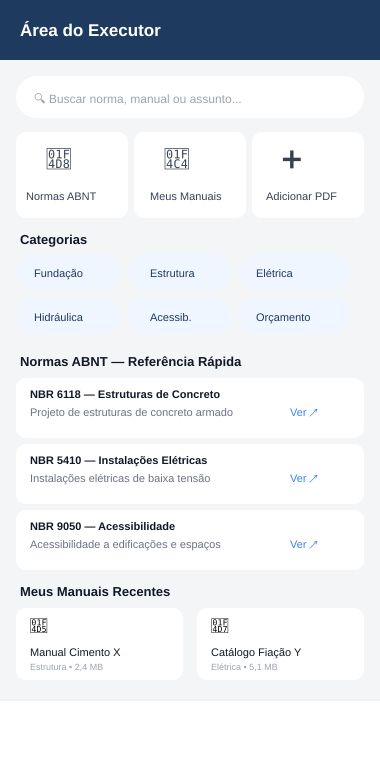

# SPEC — Área do Executor (Normas ABNT + Biblioteca de Manuais Técnicos)

> Complementa `SPEC_OBRA_MASTER.md` e `SPEC_OBRA_MASTER_KMP.md`.
> Colocar em: `docs/SPEC_AREA_EXECUTOR.md`
> Objetivo: um hub de referência técnica dentro do app — catálogo de normas ABNT relevantes à construção civil (como índice, não texto integral) e uma biblioteca pessoal de manuais em PDF, ambos pesquisáveis e vinculáveis a etapas, materiais e calculadoras.

---

## 1. Aviso Importante de Direitos Autorais (leia antes de implementar)

As normas da ABNT (NBR) **são vendidas pela própria ABNT e protegidas por direito autoral** — reproduzir o texto integral dentro do app, mesmo para uso privado do próprio Tiago, não é permitido sem licenciamento. Por isso este módulo é desenhado em duas camadas bem separadas:

1. **Catálogo de Normas (índice)** — só metadado: número, título oficial, categoria, um resumo de escopo **escrito em linguagem própria** (não copiado da norma) e um link para a fonte oficial de compra/consulta (Catálogo ABNT). Isso é livre de problema de direitos autorais — números e títulos de normas são fatos públicos, o texto normativo em si não é reproduzido.
2. **Biblioteca de Manuais (arquivos)** — aqui o usuário anexa **os próprios PDFs que já possui legalmente** (norma comprada, manual de fabricante, apostila própria, anotação pessoal). O app funciona como um gerenciador de documentos privados do usuário — armazenamento e busca local, sem redistribuição a terceiros. É equivalente a guardar esses PDFs no Google Drive ou numa pasta do computador; a responsabilidade sobre a origem/licença de cada arquivo anexado é do usuário.

**Regra de implementação:** nunca pré-carregar o app com PDFs de normas de terceiros. O catálogo (camada 1) vem vazio de arquivo; o botão "Anexar meu PDF" é sempre uma ação explícita do usuário.

---

## 2. Modelo de Dados

### 2.1 Catálogo de Normas (dado do app, não editável pelo usuário comum)

```kotlin
data class NormaABNT(
    val id: String,
    val numero: String,             // ex.: "NBR 6118"
    val titulo: String,             // título oficial (fato público)
    val categoria: CategoriaNorma,
    val escopoResumo: String,       // resumo próprio, curto, não é cópia do texto normativo
    val urlCatalogoOficial: String, // link para o Catálogo ABNT (compra/consulta oficial)
    val normasRelacionadas: List<String> = emptyList(), // outros "numero"
    val vinculadaCalculadoras: List<String> = emptyList(), // ids de calculadoras relacionadas
    val vinculadaEtapasTemplate: List<String> = emptyList() // nomes de etapas relacionadas
)

enum class CategoriaNorma {
    FUNDACAO, ESTRUTURA, ALVENARIA, ELETRICA, HIDRAULICA,
    ACESSIBILIDADE, DESEMPENHO, ORCAMENTO_CUSTOS, SEGURANCA_TRABALHO,
    IMPERMEABILIZACAO, PROJETO_ARQUITETONICO, OUTRA
}
```

- Distribuído como **seed de dados** dentro do app (arquivo JSON em assets, seção 5), atualizável em versões futuras do app sem precisar mexer em código.
- Editável pelo Gestor apenas para adicionar **normas próprias da empresa** (procedimentos internos) na mesma lista, marcadas como `origemPersonalizada = true`.

### 2.2 Biblioteca de Manuais (arquivos do usuário)

```kotlin
data class DocumentoTecnico(
    val id: String,
    val nome: String,
    val tipo: TipoDocumento,          // NORMA_PROPRIA, MANUAL_FABRICANTE, APOSTILA, PROCEDIMENTO_INTERNO, OUTRO
    val categoria: CategoriaNorma,
    val arquivoKey: String,           // referência no DocumentStore (seção 4)
    val tamanhoBytes: Long,
    val normaVinculadaId: String?,    // se este PDF é a norma X que o usuário comprou
    val tags: List<String>,
    val vinculadaEtapasTemplate: List<String> = emptyList(),
    val vinculadaMaterialId: String? = null,
    val textoExtraido: String?,       // conteúdo extraído do PDF, usado só para busca local
    val adicionadoEm: Long
)

enum class TipoDocumento { NORMA_PROPRIA, MANUAL_FABRICANTE, APOSTILA, PROCEDIMENTO_INTERNO, OUTRO }
```

- `textoExtraido` fica só no dispositivo (índice de busca local — SQLite FTS), nunca é enviado a servidor ou à IA por padrão (ver seção 6, privacidade).

---

## 3. Busca



- Uma única barra de busca no topo do hub cobre **catálogo de normas + biblioteca de manuais** ao mesmo tempo, com resultados agrupados por seção.
- Busca no catálogo: por número, título ou categoria (busca simples, poucos registros).
- Busca nos manuais: **full-text** sobre `textoExtraido` de todos os PDFs — usa índice **FTS (Full-Text Search)** do SQLite via SQLDelight (`fts4`/`fts5`), funciona 100% offline.

```kotlin
object BibliotecaSearchEngine {
    fun buscarNormas(query: String, normas: List<NormaABNT>): List<NormaABNT>
    fun buscarDocumentos(query: String, indiceFts: FtsIndex): List<DocumentoTecnico>
}
```

---

## 4. Extração de Texto de PDF (para indexar a busca)

Ao anexar um novo PDF, o app extrai o texto em segundo plano para permitir busca — **não para exibir/reconstruir o documento**, só para indexação.

```kotlin
// commonMain
expect class PdfTextExtractor {
    suspend fun extrairTexto(pdfBytes: ByteArray): String
}

expect class DocumentStore {
    suspend fun salvar(pdfBytes: ByteArray, nome: String): String   // retorna arquivoKey
    suspend fun abrir(key: String): ByteArray?
    suspend fun excluir(key: String)
}
```

| Plataforma | `PdfTextExtractor` | `DocumentStore` |
|---|---|---|
| Android | PdfBox-Android (extração de texto) | `filesDir/documentos/` |
| iOS | PDFKit (`PDFDocument.string`) | `NSFileManager` documents |
| Web | pdf.js (`getTextContent`) | OPFS / IndexedDB |

- Visualização do PDF em si usa o visualizador nativo de cada plataforma (`PdfKit` view / `PDFViewer` do navegador / intent Android) — o app não precisa renderizar PDF do zero, só extrair texto para busca e abrir o arquivo original quando o usuário quiser ler.

---

## 5. Seed do Catálogo de Normas (exemplo inicial)

Arquivo `normas_abnt_seed.json`, empacotado nos assets do app — resumos escritos em linguagem própria, sem copiar texto normativo:

```json
[
  {
    "numero": "NBR 6118",
    "titulo": "Projeto de Estruturas de Concreto — Procedimento",
    "categoria": "ESTRUTURA",
    "escopoResumo": "Define os requisitos para projeto de estruturas de concreto simples, armado e protendido, cobrindo segurança, durabilidade e desempenho estrutural.",
    "vinculadaCalculadoras": ["ferragem_kg_m3"],
    "vinculadaEtapasTemplate": ["Estrutura"]
  },
  {
    "numero": "NBR 6120",
    "titulo": "Ações para o Cálculo de Estruturas de Edificações",
    "categoria": "ESTRUTURA",
    "escopoResumo": "Estabelece os valores de cargas a considerar no cálculo estrutural de edificações.",
    "normasRelacionadas": ["NBR 6118", "NBR 6122"]
  },
  {
    "numero": "NBR 6122",
    "titulo": "Projeto e Execução de Fundações",
    "categoria": "FUNDACAO",
    "escopoResumo": "Fixa os critérios para projeto e execução de fundações de edificações."
  },
  {
    "numero": "NBR 5410",
    "titulo": "Instalações Elétricas de Baixa Tensão",
    "categoria": "ELETRICA",
    "escopoResumo": "Define os requisitos de segurança para instalações elétricas de baixa tensão em edificações."
  },
  {
    "numero": "NBR 5626",
    "titulo": "Instalações Prediais de Água Fria",
    "categoria": "HIDRAULICA",
    "escopoResumo": "Estabelece exigências para instalações prediais de água fria."
  },
  {
    "numero": "NBR 8160",
    "titulo": "Sistemas Prediais de Esgoto Sanitário",
    "categoria": "HIDRAULICA",
    "escopoResumo": "Fixa exigências para projeto e execução de sistemas de esgoto sanitário predial."
  },
  {
    "numero": "NBR 9050",
    "titulo": "Acessibilidade a Edificações, Mobiliário, Espaços e Equipamentos Urbanos",
    "categoria": "ACESSIBILIDADE",
    "escopoResumo": "Estabelece critérios e parâmetros técnicos de acessibilidade para pessoas com deficiência ou mobilidade reduzida."
  },
  {
    "numero": "NBR 15575",
    "titulo": "Edificações Habitacionais — Desempenho",
    "categoria": "DESEMPENHO",
    "escopoResumo": "Norma de desempenho: define requisitos mínimos de segurança, habitabilidade e sustentabilidade para edificações habitacionais."
  },
  {
    "numero": "NBR 9575",
    "titulo": "Impermeabilização — Seleção e Projeto",
    "categoria": "IMPERMEABILIZACAO",
    "escopoResumo": "Estabelece critérios para seleção e projeto de sistemas de impermeabilização."
  },
  {
    "numero": "NBR 12721",
    "titulo": "Avaliação de Custos de Construção para Incorporação Imobiliária",
    "categoria": "ORCAMENTO_CUSTOS",
    "escopoResumo": "Define critérios para orçamento de obra e cálculo do custo unitário básico (CUB) por padrão construtivo."
  },
  {
    "numero": "NR 18",
    "titulo": "Segurança e Saúde no Trabalho na Indústria da Construção",
    "categoria": "SEGURANCA_TRABALHO",
    "escopoResumo": "Norma regulamentadora do Ministério do Trabalho com requisitos de segurança em canteiros de obra (não é NBR, mas de uso constante no dia a dia do executor)."
  }
]
```

> Este seed é um **ponto de partida ilustrativo**, não uma lista exaustiva — recomendo revisar/ampliar com o Antigravity conforme as normas mais usadas no seu dia a dia (ex.: NBR 13532/13531 para projetos de arquitetura, NBR 7229 para fossa séptica, NBR 6494 para segurança em andaimes).

---

## 6. Vínculos com Outros Módulos

- **Calculadoras de Engenharia** (`SPEC_OBRA_MASTER.md` seção 4.12): cada calculadora pode referenciar a norma que a fundamenta (ex.: calculadora de ferragem → NBR 6118). Um ícone "📘 Base normativa" na tela da calculadora leva direto para a norma no catálogo.
- **Etapas de Obra**: template de etapas pode sugerir normas relevantes daquela etapa (ex.: etapa "Elétrica" sugere NBR 5410).
- **Cadastro de Materiais**: material pode ter um manual de fabricante vinculado (`vinculadaMaterialId`) — útil para consultar ficha técnica rápido durante a compra ou execução.
- **Assistente de IA** (`SPEC_ASSISTENTE_IA.md`): quando o usuário pergunta algo tecnicamente específico (ex.: "qual a bitola mínima de fiação para esse circuito?"), o Assistente pode indicar a norma relevante do catálogo como referência — mas **nunca cita texto normativo que não tenha**, só aponta "consulte a NBR 5410" e, se o usuário já tiver o PDF próprio anexado na Biblioteca, pode buscar e trazer o **trecho que o próprio usuário anexou** (aí sim é conteúdo do usuário, não do app).

---

## 7. Privacidade e Dados

- `textoExtraido` dos PDFs do usuário **fica só no dispositivo** por padrão — nunca é enviado ao backend nem à API de IA automaticamente.
- Se o usuário perguntar ao Assistente algo que exija consultar um manual próprio, o app pode (com consentimento explícito, por pergunta) enviar **só o trecho relevante** encontrado pela busca local, nunca o documento inteiro.
- Documentos técnicos não entram no `SyncEngine` (`SPEC_OBRA_MASTER_KMP.md` seção 6) da mesma forma que dados financeiros — ficam com opção de sincronizar (útil se usa Web) mas claramente marcados como "arquivo grande, ocupa espaço" antes de subir.

---

## 8. Estrutura de Pacotes (adição)

```
shared/commonMain/kotlin/.../features/areaexecutor/
├── NormaABNT.kt / DocumentoTecnico.kt
├── BibliotecaSearchEngine.kt
├── AreaExecutorViewModel.kt
└── ui/
    ├── AreaExecutorHomeScreen.kt      (mockup 11)
    ├── NormaDetalheScreen.kt          (mockup 12)
    ├── BibliotecaManuaisScreen.kt
    └── AnexarPdfScreen.kt

shared/commonMain/kotlin/.../core/pdf/
├── PdfTextExtractor.kt   (contrato expect)
└── DocumentStore.kt      (contrato expect)

shared/*/  (actual por plataforma, seção 4)

assets/
└── normas_abnt_seed.json
```

---

## 9. Regras Críticas

1. **Nunca embutir texto integral de norma ABNT no app** — só metadado (número, título, resumo próprio, link oficial).
2. O botão de anexar PDF é sempre **ação explícita do usuário** — o app nunca pré-popula a biblioteca com arquivos de terceiros.
3. `escopoResumo` de cada norma no seed é **redigido pela equipe**, nunca copiado/colado do texto oficial da norma.
4. Extração de texto de PDF serve **só para busca local** — o app não reconstrói nem exibe a norma a partir do texto extraído, só abre o PDF original que o usuário já possuía.
5. Nenhum documento técnico do usuário é enviado a servidor/IA sem consentimento explícito e escopo limitado ao trecho relevante.
6. Link "Adquirir no Catálogo Oficial ABNT" sempre presente na tela de detalhe da norma — o app direciona para a fonte legítima, nunca sugere alternativa não oficial.

---

## 10. Fases de Implementação

| Fase | Entrega |
|---|---|
| **8.5** (logo após Calculadoras, Fase 8) | Catálogo de Normas ABNT (seed + busca + tela de detalhe) — sem biblioteca de PDF ainda |
| **8.6** | Biblioteca de Manuais: `DocumentStore`, anexar PDF, abrir PDF nativo |
| **8.7** | `PdfTextExtractor` + índice FTS + busca full-text nos manuais |
| **8.8** | Vínculos: calculadora → norma, etapa → normas sugeridas, material → manual |
| **11** (junto do Assistente) | Assistente de IA pode referenciar normas do catálogo e buscar trechos de manuais próprios com consentimento |

---

## 11. Critérios de Aceite

- [ ] Nenhum texto integral de norma ABNT está embutido no app — só metadado e link oficial
- [ ] Anexar um PDF é sempre uma ação explícita, nunca automática
- [ ] Busca encontra normas por número/título e manuais por conteúdo (full-text), num único campo de busca
- [ ] Abrir um PDF anexado usa o visualizador nativo da plataforma
- [ ] Calculadora de Ferragem mostra o link para NBR 6118 como base normativa
- [ ] Nenhum `textoExtraido` de documento do usuário sai do dispositivo sem consentimento explícito por pergunta
- [ ] Excluir um documento técnico remove o arquivo e o índice de busca associado
