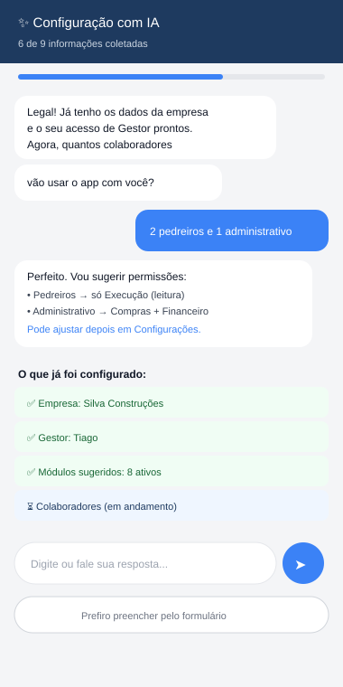

# SPEC — Onboarding (Primeiro Acesso) do ObraMaster

> Complementa `SPEC_OBRA_MASTER.md`, `SPEC_OBRA_MASTER_ADENDO_FINANCEIRO.md`, `SPEC_OBRA_MASTER_ADENDO_BDI.md` e `SPEC_ASSISTENTE_IA.md`.
> Colocar em: `docs/SPEC_ONBOARDING.md`
> Objetivo: garantir que, ao abrir o app pela primeira vez, o Gestor saia com **tudo o que precisa para começar a usar de verdade** — não só uma conta criada, mas empresa, contas financeiras, categorias, módulos, e opcionalmente colaboradores e o primeiro projeto já cadastrados.

---

## 1. Princípio de Design

Existem **dois caminhos para o mesmo destino**, e o usuário escolhe (e pode trocar) a qualquer momento:

1. **Wizard tradicional** — formulários passo a passo, rápido para quem já sabe o que quer preencher.
2. **Guiado por IA** — conversa em linguagem natural, a IA pergunta e preenche por trás; melhor para quem não é íntimo de tecnologia.

Os dois caminhos escrevem no **mesmo estado** (`OnboardingState`) e passam pelas **mesmas validações**. A IA não é um sistema paralelo — é só uma interface alternativa de preenchimento do mesmo formulário. Isso significa: nenhuma regra de negócio é duplicada, e trocar de um modo para o outro no meio do processo não perde nada já preenchido.

---

## 2. As Etapas (conteúdo, independente do modo de preenchimento)

| Ordem | Etapa | Obrigatório? | Dado coletado |
|---|---|---|---|
| 1 | Boas-vindas | — | Nenhum dado; explica o que vem a seguir |
| 2 | Dados da Empresa | ✅ | Nome, logo, CNPJ (opcional), telefone, endereço, cidade |
| 3 | Conta do Gestor | ✅ | Nome, foto (opcional), login, senha |
| 4 | Módulos Iniciais | ✅ (com sugestão pronta) | Quais módulos ativar (pré-marcados com um conjunto recomendado) |
| 5 | Contas Financeiras | ✅ (mínimo 1) | Nome da conta, tipo (caixa/corrente/etc.), saldo inicial |
| 6 | Categorias Financeiras | Opcional | Usar categorias padrão do sistema (recomendado) ou customizar |
| 7 | Perfil de BDI | Opcional | Usar perfil sugerido de mercado ou pular e configurar depois |
| 8 | Template de Etapas de Obra | Opcional | Usar template padrão (Fundação → Estrutura → Alvenaria → Instalações → Acabamento → Entrega) ou customizar |
| 9 | Colaboradores | Opcional, pode pular | Nome, função, permissões por módulo (pode importar da agenda) |
| 10 | Primeiro Projeto | Opcional, pode pular | Nome, endereço, área, orçamento — já deixa a primeira obra pronta |
| 11 | Acessibilidade | Opcional | Tema, fonte, tamanho de letra |
| 12 | Resumo e Conclusão | ✅ | Tela de revisão de tudo, com opção de editar qualquer etapa antes de confirmar |

**Regra de obrigatoriedade:** só o mínimo para o app funcionar (empresa, Gestor, ao menos um módulo, ao menos uma conta) é obrigatório. Tudo o resto pode ser pulado e preenchido depois — o app nunca deve travar o primeiro uso por falta de um dado secundário.

---

## 3. Wizard Tradicional


- Barra de progresso no topo (etapa N de 12).
- Botões fixos no rodapé: "Voltar" e "Continuar" (o texto do botão muda para "Pular esta etapa" quando a etapa é opcional).
- Campos de valor já usam o `CalculatorTextField` (saldo inicial de conta, orçamento do primeiro projeto).
- Dica contextual (card azul) em cada etapa explicando o porquê daquele dado — reduz abandono por não entender pra que serve.
- Progresso é **salvo a cada etapa** (não é preciso terminar tudo de uma vez — se o app fechar, retoma de onde parou).

---

## 4. Onboarding Guiado por IA



Na tela de Boas-vindas, duas opções lado a lado: **"Configurar com ajuda da IA"** e **"Preencher formulário"**. A qualquer momento dentro do modo IA, um botão "Prefiro preencher pelo formulário" leva para o wizard tradicional **na mesma etapa**, com o que já foi coletado preservado.

### 4.1 Como funciona

- A IA conduz uma conversa curta, uma pergunta por vez (nunca um formulário inteiro em texto — isso mata a vantagem do modo conversa).
- Cada resposta do usuário é interpretada e mapeada para os campos da etapa correspondente (seção 2).
- Um painel lateral/inferior mostra **o que já foi confirmado** (checklist verde), dando transparência de progresso — igual ao wizard, só que preenchido pela conversa.
- Se a resposta for ambígua (ex.: "não sei o CNPJ agora"), a IA marca o campo como pulado e segue — nunca trava esperando uma resposta perfeita.
- Ao fim, cai na **mesma tela de Resumo e Conclusão** do wizard (etapa 12) — o usuário sempre revisa e confirma antes de qualquer dado ser gravado de verdade no banco.

### 4.2 Arquitetura técnica

Reaproveita a mesma infraestrutura da spec do Assistente de IA (`SPEC_ASSISTENTE_IA.md`), com um modo dedicado:

```
POST /assistant/onboarding
Body: {
  etapaAtual: OnboardingStep,
  estadoAtual: OnboardingState,     // tudo já coletado até agora
  respostaUsuario: string
}

Response: {
  falaAssistente: string,               // próxima pergunta ou confirmação
  estadoAtualizado: OnboardingState,    // com os novos campos preenchidos
  etapaConcluida: boolean,
  sugestoes: List<CampoSugerido>?       // ex.: permissões sugeridas para os colaboradores citados
}
```

- **Offline:** o modo IA fica indisponível (mostra aviso e sugere o wizard tradicional) — não há fallback local aqui porque é conversa livre, diferente da busca no manual que tem versão offline.
- O `OnboardingEngine` (seção 5) faz a validação final dos dados vindos da IA — a IA nunca escreve direto no banco, só propõe valores para o mesmo estado validado que o wizard usa.

---

## 5. Modelo de Dados e Engine (compartilhado pelos dois modos)

```kotlin
enum class OnboardingStep {
    BOAS_VINDAS, EMPRESA, GESTOR, MODULOS, CONTAS_FINANCEIRAS,
    CATEGORIAS, BDI, TEMPLATE_ETAPAS, COLABORADORES,
    PRIMEIRO_PROJETO, ACESSIBILIDADE, RESUMO
}

data class OnboardingState(
    val etapaAtual: OnboardingStep = OnboardingStep.BOAS_VINDAS,
    val empresa: DadosEmpresa? = null,
    val gestor: GestorDraft? = null,
    val modulosAtivos: Set<AppModule> = ModuleRegistry.SUGESTAO_INICIAL,
    val contas: List<ContaDraft> = emptyList(),
    val usarCategoriasDefault: Boolean = true,
    val categoriasCustom: List<CategoriaFinanceira> = emptyList(),
    val perfilBdi: ConfigBDI? = null,
    val templateEtapas: List<String> = TemplateEtapas.PADRAO,
    val colaboradores: List<ColaboradorDraft> = emptyList(),
    val primeiroProjeto: ProjetoDraft? = null,
    val acessibilidade: PrefsAcessibilidade = PrefsAcessibilidade.PADRAO,
    val etapasConcluidas: Set<OnboardingStep> = emptySet()
)

object OnboardingEngine {
    // Função pura — mesma usada pelo wizard e pelo modo IA
    fun validarEtapa(step: OnboardingStep, state: OnboardingState): ValidationResult
    fun avancar(state: OnboardingState): OnboardingState
    fun voltar(state: OnboardingState): OnboardingState
    fun podeConcluir(state: OnboardingState): Boolean  // checa só os obrigatórios (seção 2)

    // Executado apenas na etapa de Resumo, ao confirmar — grava tudo de uma vez, em transação
    suspend fun commitar(state: OnboardingState, db: ObraMasterDatabase)
}
```

- `OnboardingState` é persistido incrementalmente em `Settings` local (multiplatform-settings) como rascunho — garante retomada caso o app feche no meio.
- `commitar()` roda em uma única transação: cria empresa, Gestor (com hash de senha), módulos ativos, contas com seus saldos iniciais, categorias, perfil de BDI, etapas-template, colaboradores com permissões, e o primeiro projeto (se preenchido) — nada fica gravado parcialmente se o processo for interrompido antes da confirmação final.

### 5.1 Sugestão inicial de módulos

```kotlin
object ModuleRegistry {
    val SUGESTAO_INICIAL = setOf(
        AppModule.PROJETOS, AppModule.FINANCEIRO, AppModule.EQUIPES,
        AppModule.COMPRAS, AppModule.CADASTROS_BASE, AppModule.PESSOAS,
        AppModule.CALCULADORAS, AppModule.RELATORIOS
    )
    // Vendas, Orçamentos, Planejamento, Metas ficam desmarcados por padrão,
    // mas visíveis e fáceis de ligar depois — evita sobrecarregar quem está começando
}
```

---

## 6. Tela de Resumo e Conclusão

- Lista tudo o que foi coletado, organizado pelas mesmas etapas da seção 2, cada bloco com um link "Editar".
- Botão final **"Concluir e Começar a Usar"** — só habilitado quando `OnboardingEngine.podeConcluir()` retorna verdadeiro.
- Ao confirmar: roda `commitar()`, mostra um loading curto, e leva para a Home (seção 2 do Manual) já com os dados reais.

---

## 7. Atualização no Manual do Usuário

A seção `#login` do `MANUAL_DO_PROGRAMA.md` deve ser expandida para descrever este fluxo (referenciado pelo Assistente de IA quando alguém perguntar "como reconfigurar minha empresa" ou similar, depois do primeiro uso):

> **Trecho a adicionar em `MANUAL_DO_PROGRAMA.md`, seção 1:**
>
> No primeiro uso, um assistente de configuração inicial pede os dados da sua empresa, cria seu acesso de Gestor e já deixa contas financeiras, categorias e módulos prontos para uso. Você pode preencher pelo formulário tradicional ou pedir para a **IA conduzir a conversa** — ela pergunta um dado de cada vez e você responde em português normal, sem precisar entender os termos técnicos do sistema. Dá para trocar de um modo para o outro a qualquer momento, e nada é gravado de verdade até você confirmar na tela final de resumo. Esses dados podem ser alterados depois em Configurações a qualquer momento.

---

## 8. Regras Críticas

1. **Nada é gravado no banco até a confirmação final** na tela de Resumo — os dois modos (wizard e IA) só manipulam o `OnboardingState` em memória/rascunho local.
2. **Só o mínimo é obrigatório** (empresa, Gestor, 1 módulo, 1 conta) — o resto é sempre "pular e configurar depois".
3. **A IA nunca inventa dado que o usuário não informou** — campo não respondido fica vazio/pulado, nunca preenchido com suposição.
4. **Progresso é retomável** — fechar o app no meio do onboarding não perde o que já foi preenchido.
5. **Trocar de modo (wizard ↔ IA) preserva o estado** — é a mesma `OnboardingState`, só muda a interface de preenchimento.
6. **`commitar()` é transacional** — tudo ou nada, nunca deixa o banco com uma configuração inicial pela metade.

---

## 9. Critérios de Aceite

- [ ] É possível concluir o onboarding só com o mínimo obrigatório, pulando tudo o que é opcional
- [ ] Fechar o app no meio do onboarding e reabrir retoma exatamente na etapa em que parou
- [ ] Trocar do modo IA para o wizard no meio do processo preserva os dados já coletados
- [ ] Nenhum dado aparece no banco (colaborador, conta, projeto) antes da confirmação final na tela de Resumo
- [ ] Módulos sugeridos vêm pré-marcados, mas todos são editáveis antes de confirmar
- [ ] Modo IA sem internet mostra aviso claro e oferece o wizard tradicional, sem travar
- [ ] Ao final, o Gestor cai direto na Home já com empresa, módulos, contas (e o que mais tiver preenchido) funcionando de verdade
