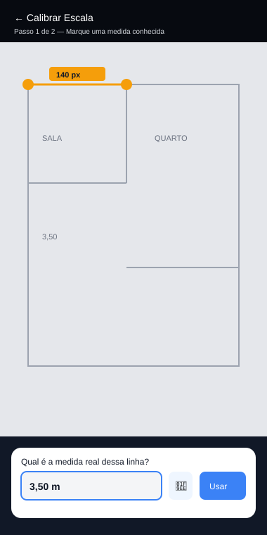

# SPEC — Módulo Planta Baixa (Editor de Desenho + Importação por Foto)

> Complementa `SPEC_OBRA_MASTER.md`, `SPEC_OBRA_MASTER_KMP.md` e `SPEC_OBRA_MASTER_ADENDO_FINANCEIRO.md`.
> Colocar em: `docs/SPEC_PLANTA_BAIXA.md`
> Objetivo: permitir ao usuário desenhar um esboço funcional da planta (cômodos, paredes, portas, janelas) parecido com o real, **ou** fotografar um projeto de arquitetura existente, calibrar a escala e extrair as medidas — em ambos os casos, a área calculada alimenta automaticamente o campo `areaConstruidaM2` do Projeto.

---

## 1. Visão Geral — Dois Caminhos, Um Resultado

```
Caminho A — Desenhar do zero          Caminho B — Importar projeto existente
   Tela em branco + grade                  Foto/PDF do projeto como fundo
        │                                          │
   Ferramentas: retângulo,                    Calibrar escala (marcar uma
   parede, porta, janela                       medida conhecida na imagem)
        │                                          │
        └──────────────► Planta com cômodos, área e perímetro calculados ◄──────────────┘
                                          │
                          Área total soma automaticamente no
                          campo "Área Construída" do Projeto
```

Os dois caminhos terminam na **mesma estrutura de dados** (`PlantaBaixa` com `Comodo`, `Parede`, `Abertura`) — a foto, quando usada, vira só uma **camada de fundo de referência** (opcional, pode ser desligada depois de traçado) por trás do desenho vetorial real, que é o que efetivamente gera os números.

---

## 2. Modelo de Dados

```kotlin
data class PlantaBaixa(
    val id: String,
    val projetoId: String,
    val nome: String,                    // ex.: "Pavimento Térreo"
    val escalaPxPorMetro: Double,        // fator de calibração
    val imagemFundoKey: String?,         // referência no ImageStore, se importada por foto
    val imagemFundoOpacidade: Float = 0.5f,
    val criadaEm: Long,
    val atualizadaEm: Long
)

data class Comodo(
    val id: String,
    val plantaId: String,
    val nome: String,                    // ex.: "Sala", "Quarto 1"
    val pontos: List<PontoXY>,           // polígono fechado, em coordenadas do canvas (px)
    val corPreenchimento: String,        // hex, referencia Cadastro de Cores (módulo já existente)
    val areaM2: Double,                  // calculado, nunca digitado manualmente
    val perimetroM: Double               // calculado
)

data class Parede(
    val id: String,
    val plantaId: String,
    val pontoInicio: PontoXY,
    val pontoFim: PontoXY,
    val espessuraCm: Double = 15.0,      // padrão 15cm, editável
    val estrutural: Boolean = false
)

data class Abertura(
    val id: String,
    val paredeId: String,
    val tipo: TipoAbertura,              // PORTA | JANELA
    val posicaoNaParede: Double,         // 0.0 a 1.0, posição relativa ao longo da parede
    val larguraCm: Double
)

data class PontoXY(val x: Double, val y: Double)
enum class TipoAbertura { PORTA, JANELA }
```

- Um Projeto pode ter **múltiplas** `PlantaBaixa` (ex.: térreo, pavimento superior) — a área construída do projeto soma a área de todas.
- `Comodo.corPreenchimento` reaproveita o **Cadastro de Cores** já especificado (`SPEC_OBRA_MASTER.md` seção 4.11) — outro ponto de reuso, não duplicação.

---

## 3. PlantaBaixaEngine (função pura, `commonMain`)

Reaproveita o `AreaEngine`/cálculo de área irregular por coordenadas (Shoelace) já especificado no módulo de Calculadoras (`SPEC_OBRA_MASTER.md` seção 4.12) — é a mesma matemática, só aplicada ao desenho em vez de digitada manualmente.

```kotlin
object PlantaBaixaEngine {

    // Área de um polígono fechado — fórmula de Shoelace (já existe em AreaEngine, reaproveitada aqui)
    fun calcularAreaM2(pontos: List<PontoXY>, escalaPxPorMetro: Double): Double

    fun calcularPerimetroM(pontos: List<PontoXY>, escalaPxPorMetro: Double): Double

    // Soma a área de todos os cômodos de todas as plantas de um projeto
    fun areaTotalConstruida(plantas: List<PlantaBaixa>, comodos: List<Comodo>): Double

    // Ajuda visual ao desenhar: gruda em ângulos retos e no grid, como em CAD simples
    fun snapAngulo(pontoAtual: PontoXY, pontoAnterior: PontoXY, grausSnap: Double = 15.0): PontoXY
    fun snapGrade(ponto: PontoXY, tamanhoGradePx: Double): PontoXY

    // Calibração: dados dois pontos na imagem + distância real informada, retorna a escala
    fun calcularEscala(pontoA: PontoXY, pontoB: PontoXY, distanciaRealM: Double): Double

    // Detecta se um polígono está fechado corretamente (ponto final ≈ ponto inicial) — evita
    // cômodo com "buraco" que geraria área errada
    fun poligonoFechado(pontos: List<PontoXY>, toleranciaPx: Double = 10.0): Boolean
}
```

- 100% testável em `commonTest`, sem dependência de Compose/Canvas — a UI só invoca a engine.

---

## 4. Caminho A — Editor de Desenho


### 4.1 Ferramentas da barra superior

| Ferramenta | Comportamento |
|---|---|
| **▭ Cômodo (retângulo)** | Arrastar na tela desenha um retângulo — vira `Comodo` automaticamente com 4 paredes. Forma mais rápida para cômodos regulares. |
| **📐 Cômodo (polígono livre)** | Toque ponto a ponto para formar qualquer formato (cômodos em L, mansardas, etc.) — fecha ao tocar no ponto inicial. |
| **🚪 Porta** | Toque numa parede existente para inserir; arrasta para ajustar posição e largura. |
| **🪟 Janela** | Igual porta, com ícone e representação diferente. |
| **📏 Medir** | Toque em dois pontos quaisquer do desenho — mostra a distância real (em metros) sem criar elemento. Útil para conferir. |
| **🖼 Imagem de fundo** | Liga/desliga a camada de foto importada (Caminho B) e ajusta sua opacidade. |
| **↩ Desfazer** | Histórico de ações (undo/redo padrão). |

### 4.2 Comportamento de desenho

- **Grade (grid) configurável**: por padrão, 1 quadrado = 0,5 m — ajuda a manter proporção mesmo sem foto de referência.
- **Snap automático**: ao desenhar perto de 90°/ângulos retos entre paredes, o traço "gruda" no ângulo — igual softwares de planta baixa simplificados.
- **Rótulo automático em cada cômodo**: nome (editável por toque) + área calculada, sempre visível dentro do desenho.
- **Painel do cômodo selecionado**: mostra área e perímetro no rodapé, com confirmação visual de que está somando na área construída do projeto.
- **Escala manual**: se o usuário não importar foto, define a escala digitando "1 quadrado da grade = X metros" (usa `CalculatorTextField`).

---

## 5. Caminho B — Importar Projeto por Foto + Calibrar Escala



### 5.1 Fluxo

1. Usuário toca **"Importar do projeto"** → usa o `ImagePicker` (contrato já existente em `SPEC_OBRA_MASTER_KMP.md` seção 4) para tirar foto ou escolher da galeria (inclusive foto de um PDF de projeto exportado como imagem).
2. A imagem entra como **camada de fundo** semitransparente no editor.
3. **Calibração obrigatória antes de desenhar**: o usuário traça uma linha sobre qualquer medida que já apareça no projeto (uma parede com cota impressa, por exemplo "3,50") e digita o valor real dessa medida.
4. `PlantaBaixaEngine.calcularEscala()` converte pixels → metros para toda a planta.
5. Usuário traça por cima da foto usando as mesmas ferramentas do Caminho A (retângulo/polígono) — a foto é só guia visual, o que gera os números é o traço vetorial.
6. Pode recalibrar a qualquer momento (ex.: se a foto foi tirada em ângulo e a escala não bateu direito ao conferir com outra medida conhecida).

### 5.2 Reconhecimento de texto (OCR) — assistente de calibração, não fonte de verdade

Para agilizar (não substituir) a calibração manual:

```kotlin
// commonMain
expect class TextRecognizer {
    suspend fun isAvailable(): Boolean
    suspend fun reconhecerNumeros(imagem: ImageRef): List<TextoDetectado>
}

data class TextoDetectado(val texto: String, val regiao: RetanguloXY, val confianca: Float)
```

| Plataforma | Implementação |
|---|---|
| Android | ML Kit Text Recognition (on-device) |
| iOS | Vision Framework (`VNRecognizeTextRequest`) |
| Web | Tesseract.js (roda no navegador) |

- Ao importar a foto, o app roda o OCR em segundo plano e **sugere** (não aplica sozinho) cotas encontradas perto de cada parede desenhada — ex.: "Detectei '3,50' perto desta linha, usar como calibração?".
- **Nunca aplica automaticamente** — plantas antigas/escaneadas têm OCR pouco confiável; a confirmação do usuário é sempre obrigatória antes de qualquer número virar escala ou medida real.
- Se `isAvailable()` for falso (ou a plataforma não suportar), a calibração manual (seção 5.1) continua funcionando normalmente — OCR é aceleração opcional, nunca dependência.

---

## 6. Integração com o Projeto

- Campo `areaConstruidaM2` do `Projeto` (já existente em `SPEC_OBRA_MASTER.md` seção 4.1) ganha uma opção **"Calcular a partir da Planta"** ao lado da entrada manual — quando há ao menos uma `PlantaBaixa` vinculada, o valor vem de `PlantaBaixaEngine.areaTotalConstruida()` em vez de ser digitado.
- Se o usuário editar a planta depois, o custo/m² do projeto (já calculado pelo `BudgetEngine`) recalcula automaticamente — sem retrabalho manual.
- A planta baixa também é **exportável** (JPG/PDF) pelo mesmo `ExportEngine`/`ReportCanvasRenderer` já especificado — útil para levar impressa pra obra ou anexar num orçamento.

---

## 7. Estrutura de Pacotes (adição)

```
shared/commonMain/kotlin/.../features/plantabaixa/
├── PlantaBaixaEngine.kt          (função pura)
├── PlantaBaixaViewModel.kt
└── ui/
    ├── EditorPlantaScreen.kt     (Canvas com pointer input, ferramentas)
    ├── CalibracaoScreen.kt
    └── components/               (ToolbarPlanta, ComodoLabel, ReguaMedida)

shared/commonMain/kotlin/.../core/ocr/
└── TextRecognizer.kt              (contrato expect)

shared/androidMain / iosMain / wasmJsMain/
└── TextRecognizer (actual por plataforma, seção 5.2)
```

---

## 8. Regras Críticas

1. **A foto nunca é a fonte dos números** — só o traço vetorial (`Comodo`/`Parede`) gera área/perímetro. A imagem é referência visual, descartável a qualquer momento sem perder o desenho já traçado.
2. **Calibração é obrigatória** antes de qualquer medida ser considerada real — sem escala definida, o editor não permite salvar cômodos com área "oficial" (mostra em modo rascunho até calibrar).
3. **OCR nunca aplica automaticamente** — é sempre sugestão, com confirmação explícita do usuário.
4. `PlantaBaixaEngine` é função pura, sem dependência de Compose — testável em `commonTest`, roda igual nas 3 plataformas.
5. Cálculo de área usa a **mesma fórmula** (Shoelace) já usada na calculadora de área irregular — não duplicar lógica.
6. A área da planta **não sobrescreve silenciosamente** um valor de área já digitado manualmente no Projeto — o usuário escolhe explicitamente qual fonte usar.

---

## 9. Fases de Implementação (encaixe nas fases já existentes)

| Fase | Entrega |
|---|---|
| **3.5** (logo após Projetos/Etapas, Fase 3) | `PlantaBaixaEngine` + editor de desenho básico (retângulo, polígono livre, cálculo de área/perímetro) — Caminho A completo |
| **3.6** | Importação de foto + tela de calibração manual — Caminho B sem OCR |
| **9.5** (junto da Fase 9, Exportação) | Exportação da planta em JPG/PDF via `ReportCanvasRenderer` |
| **11.5** (opcional, após o core estar sólido) | OCR de sugestão de cotas (`TextRecognizer`) — feature de aceleração, não bloqueia lançamento sem ela |

---

## 10. Critérios de Aceite

- [ ] Desenhar um retângulo gera um `Comodo` com área e perímetro corretos, sem digitação manual
- [ ] Desenhar um polígono livre (cômodo em L) calcula a área corretamente pela fórmula de Shoelace
- [ ] Importar uma foto, calibrar com uma medida conhecida, e traçar por cima produz medidas reais consistentes (validado comparando com uma segunda medida conhecida na mesma foto)
- [ ] Área total da(s) planta(s) pode ser usada como `areaConstruidaM2` do Projeto, recalculando o custo/m²
- [ ] Sem calibração, o editor não permite marcar a planta como "área oficial" do projeto
- [ ] OCR (quando disponível) sugere cotas mas nunca aplica sem confirmação
- [ ] Planta exportável em JPG e PDF com qualidade legível para impressão
