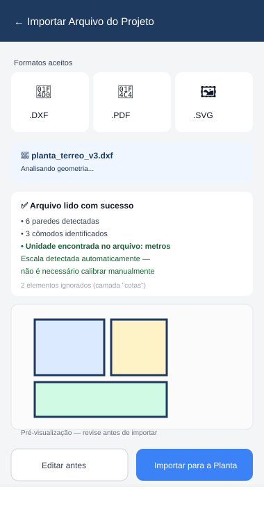

# ADENDO — Importação de DXF, PDF e SVG na Planta Baixa

> Complementa `SPEC_PLANTA_BAIXA.md`.
> Colocar em: `docs/SPEC_PLANTA_BAIXA_ADENDO_IMPORTACAO.md`
> Objetivo: além de desenhar do zero ou fotografar um projeto (já especificado), permitir importar diretamente arquivos **DXF**, **PDF** e **SVG** de dentro da área de Projeto, lendo a geometria sempre que possível em vez de exigir novo traçado manual.

---

## 1. Por que cada formato é tratado diferente

Nem todo formato chega da mesma forma — a estratégia muda conforme o que o arquivo realmente contém:

| Formato | Natureza | Estratégia |
|---|---|---|
| **DXF** | Vetorial, formato de texto (tags), frequentemente com **unidade de medida real embutida** (`$INSUNITS` no cabeçalho) | Parser próprio em `commonMain` — lê a geometria e, quando a unidade está no arquivo, **calibra sozinho**, sem exigir calibração manual |
| **SVG** | Vetorial, XML, geralmente em pixels (raramente com unidade real declarada) | Parser próprio em `commonMain` — lê a geometria, mas normalmente ainda exige o passo de calibração manual (como na importação de foto), a menos que o SVG traga `viewBox` com unidade real |
| **PDF** | Pode ser vetorial (exportado de um CAD) ou só uma imagem escaneada dentro do PDF | Duas rotas: extração vetorial quando possível (via biblioteca de plataforma), ou fallback para o fluxo de foto+calibração já existente quando o PDF é essencialmente uma imagem |

Em todos os casos, o resultado da leitura é sempre apresentado como um **rascunho editável para revisão** — nunca vira a planta oficial do projeto sem o usuário confirmar (mesma regra já aplicada ao OCR na spec original).

---

## 2. DXF — Parser Próprio (o caminho mais forte)

DXF (ASCII) é um formato de tags texto simples (`código de grupo` + `valor`, em pares de linhas) — dá para parsear inteiramente em Kotlin puro, **sem nenhuma dependência de plataforma**.

### 2.1 O que o parser lê

- Seção `HEADER`, variável `$INSUNITS` → detecta a unidade (milímetros, centímetros, metros, polegadas) automaticamente.
- Seção `ENTITIES`, tipos relevantes:
  - `LINE` → vira segmento de `Parede`
  - `LWPOLYLINE` / `POLYLINE` (fechada) → vira `Comodo` diretamente, um ponto por vértice
  - `CIRCLE` → ignorado na v1 (útil para elementos redondos, fora de escopo inicial)
  - `TEXT` / `MTEXT` → capturado como possível **nome de cômodo** (ex.: texto "Sala" próximo de um polígono vira o rótulo automaticamente)
- Camadas (`layer`) puramente de anotação (frequentemente chamadas "cotas", "textos", "hachura") podem ser **ignoradas por padrão**, com opção de escolher quais camadas importar, numa lista de checkboxes antes de confirmar.

### 2.2 Engine (função pura, `commonMain`)

```kotlin
object DxfImporter {

    data class ResultadoImportacaoDxf(
        val paredes: List<Parede>,
        val comodos: List<Comodo>,
        val unidadeDetectada: UnidadeDxf?,   // MILIMETROS, CENTIMETROS, METROS, POLEGADAS, DESCONHECIDA
        val escalaAutomaticaPxPorMetro: Double?, // preenchido se unidadeDetectada != DESCONHECIDA
        val camadasEncontradas: List<String>,
        val elementosIgnorados: Int
    )

    fun importar(conteudoDxf: String, camadasSelecionadas: Set<String>? = null): ResultadoImportacaoDxf
}

enum class UnidadeDxf { MILIMETROS, CENTIMETROS, METROS, POLEGADAS, DESCONHECIDA }
```

- Testável em `commonTest` com arquivos DXF de exemplo (fixtures) sem precisar rodar em nenhum emulador.
- **Se `unidadeDetectada == DESCONHECIDA`**: o app cai automaticamente no fluxo de calibração manual (o mesmo da importação de foto) — o usuário marca uma medida conhecida no desenho importado e informa o valor real.

---

## 3. SVG — Parser Próprio

SVG também é texto (XML) — mesma vantagem de não depender de plataforma.

### 3.1 O que o parser lê

- Elementos `<rect>`, `<line>`, `<polygon>`, `<polyline>` → geometria direta.
- `<path>` com comandos simples (`M`, `L`, `H`, `V`, `Z`) → convertido em lista de pontos; comandos de curva (`C`, `Q`, `A`) são **aproximados por segmentos de reta** (suficiente para planta baixa, que é essencialmente ortogonal).
- Atributo `viewBox` + `width`/`height` com unidade explícita (`mm`, `cm`) → permite detecção automática de escala, igual ao DXF. Isso é raro (a maioria dos SVGs exportados de ferramentas de design usa pixels sem significado real), então **na prática, a maior parte das importações de SVG cai em calibração manual** — e a spec assume isso como caso comum, não exceção.

```kotlin
object SvgImporter {
    data class ResultadoImportacaoSvg(
        val paredes: List<Parede>,
        val comodos: List<Comodo>,
        val escalaDetectadaAutomaticamente: Boolean,
        val escalaAutomaticaPxPorMetro: Double?
    )
    fun importar(conteudoSvg: String): ResultadoImportacaoSvg
}
```

---

## 4. PDF — Estratégia Híbrida

PDF é o mais heterogêneo. Estratégia em duas tentativas, na ordem:

### 4.1 Tentativa 1 — Extração vetorial (quando o PDF veio de um CAD/software de projeto)

- Usa a biblioteca de plataforma já prevista para leitura de PDF (`SPEC_AREA_EXECUTOR.md` seção 4 — PdfBox-Android / PDFKit / pdf.js), agora estendida para **extrair caminhos vetoriais** (linhas e retângulos do conteúdo da página), não só texto.

```kotlin
// commonMain — contrato
expect class PdfVectorExtractor {
    suspend fun extrairGeometria(pdfBytes: ByteArray, pagina: Int): GeometriaExtraidaPdf?
    // retorna null se a página não tiver conteúdo vetorial reconhecível (é só imagem escaneada)
}

data class GeometriaExtraidaPdf(val segmentos: List<Par<PontoXY, PontoXY>>, val escalaDetectada: Double?)
```

| Plataforma | Implementação |
|---|---|
| Android | PdfBox-Android — percorre o content stream da página, extrai operadores de linha/retângulo |
| iOS | PDFKit não expõe geometria vetorial facilmente — nesta plataforma, **pula direto para a Tentativa 2** |
| Web | pdf.js (`getOperatorList()`) — consegue extrair operadores de desenho vetorial |

### 4.2 Tentativa 2 — Fallback como imagem (a mais comum na prática)

- Se a extração vetorial falhar, retornar vazia, ou a plataforma não suportar (caso do iOS): a página do PDF é **renderizada como imagem** e entra exatamente no fluxo já existente de **importação por foto + calibração manual** (`SPEC_PLANTA_BAIXA.md` seção 5).
- Isso cobre o caso mais comum na prática: PDF que é, na verdade, um escaneamento de uma planta impressa.

> **Recomendação de implementação:** comece só pela Tentativa 2 (mais simples, cobre a maioria dos casos reais) e adicione a Tentativa 1 depois, como refinamento — ver fases na seção 7.

---

## 5. Fluxo Único de Importação (experiência do usuário)



1. Na Área de Projeto, botão **"Importar Arquivo"** (ao lado de "Importar Foto") abre o seletor de arquivo (`expect/actual FilePicker`, novo contrato — diferente do `ImagePicker`, que só lida com fotos/galeria).
2. O app identifica o formato pela extensão/conteúdo e roda o importador correspondente (DXF, SVG ou PDF).
3. Tela de resultado mostra:
   - Quantas paredes/cômodos foram detectados
   - Se a escala foi detectada automaticamente ou se vai precisar de calibração manual
   - Lista de camadas encontradas (só para DXF), com opção de marcar quais importar
   - **Pré-visualização** da geometria antes de confirmar
4. Botões: **"Editar antes"** (abre no editor de desenho normal, com a geometria importada já carregada, para ajustar) ou **"Importar para a Planta"** (confirma direto).
5. Se a escala não foi detectada automaticamente, o fluxo emenda direto na tela de **Calibração** já especificada (`SPEC_PLANTA_BAIXA.md` seção 5.1), usando a geometria importada como referência visual em vez de uma foto.

---

## 6. Modelo de Dados (adição)

```kotlin
data class ArquivoImportado(
    val id: String,
    val plantaId: String,
    val formatoOrigem: FormatoImportacao,   // DXF, SVG, PDF, FOTO
    val nomeArquivoOriginal: String,
    val escalaDetectadaAutomaticamente: Boolean,
    val unidadeOrigem: String?,             // ex.: "metros", só relevante para DXF
    val camadasImportadas: List<String> = emptyList(),
    val importadoEm: Long
)

enum class FormatoImportacao { DXF, PDF, SVG, FOTO }
```

- Registrar de qual arquivo/formato cada `PlantaBaixa` se originou é útil para o usuário lembrar depois (ex.: "essa planta veio do DXF do arquiteto, versão 3").

---

## 7. Fases de Implementação (encaixe nas fases já existentes de Planta Baixa)

| Fase | Entrega |
|---|---|
| **3.6** (já prevista) | Importação de foto + calibração manual — sem mudança |
| **3.65** | `DxfImporter` (parser puro em commonMain) + tela de resultado/preview + detecção automática de escala via `$INSUNITS` |
| **3.66** | `SvgImporter` (parser puro em commonMain) — mesma tela de resultado, calibração manual na maioria dos casos |
| **3.67** | PDF — Tentativa 2 (fallback como imagem, reaproveitando o fluxo de foto) — cobre a maioria dos casos reais |
| **3.68** (opcional, refinamento) | PDF — Tentativa 1 (extração vetorial via PdfBox-Android/pdf.js, Android e Web primeiro; iOS pode ficar só na Tentativa 2) |

---

## 8. Regras Críticas

1. **A geometria importada nunca vira planta oficial sem revisão do usuário** — sempre aparece como pré-visualização com opção de editar antes de confirmar (mesma regra do OCR e da calibração de foto).
2. `DxfImporter` e `SvgImporter` são **funções puras em commonMain**, sem dependência de plataforma — parsers de texto/XML não precisam de `expect/actual`.
3. `PdfVectorExtractor` é o único ponto desta spec que exige `expect/actual` (só PDF tem complexidade real de biblioteca por plataforma) — e tem fallback obrigatório para não travar em nenhuma plataforma.
4. Escala automática (DXF com `$INSUNITS`, SVG com unidade real) é sempre **mostrada e confirmável**, nunca aplicada silenciosamente sem o usuário ver o resultado.
5. Camadas de anotação (textos, cotas, hachuras) do DXF podem ser ignoradas por padrão, mas a lista de camadas encontradas é sempre visível — o usuário decide o que entra.

---

## 9. Critérios de Aceite

- [ ] Importar um DXF com `$INSUNITS` = metros calibra a escala automaticamente, sem pedir calibração manual
- [ ] Importar um DXF sem unidade detectável cai no fluxo de calibração manual, sem travar
- [ ] Importar um SVG com formas básicas (retângulos, linhas) gera cômodos/paredes corretamente
- [ ] Importar um PDF vetorial (Android/Web) extrai geometria sem precisar de foto
- [ ] Importar um PDF escaneado (ou em iOS) cai automaticamente no fluxo de foto + calibração, sem erro
- [ ] Lista de camadas do DXF permite escolher quais importar antes de confirmar
- [ ] Nenhuma geometria importada substitui a planta existente sem confirmação explícita do usuário
- [ ] Testes em `commonTest` validam o parser de DXF e SVG com arquivos de exemplo fixos
